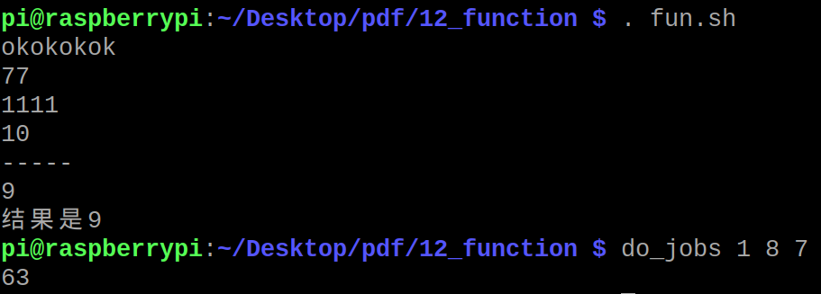

# shell中的函数定义

函数类似于c的方式编写。参数的传递相对古板一点。

```
fun(){
	xxx
	xxx
}

fun


fun2(){

	aa=$1
	bb=$2
	
	c=`expr xxx`
	
	return $c
}

fun2 11 22
dd=$?

```

shell的脚本，还能把函数变成一个全局的函数。类似于自己编写一个命令程序。

```
. func.sh  #加载到当前终端

#调用
do_jobs 1 2 3

```




### 函数单独写一个文件，如何包含？

一般会用 `source ./lib.sh` 或者 `. ./lib.sh`
注意这里是include的关系。如果lib.sh中有直接可以运行的语句。那么include进来之后，该语句会直接运行一次。


**开发总结**：

* lib.sh 里面只写函数
* main.sh 里面写主程序，并且会调用lib.sh里面的一些函数。