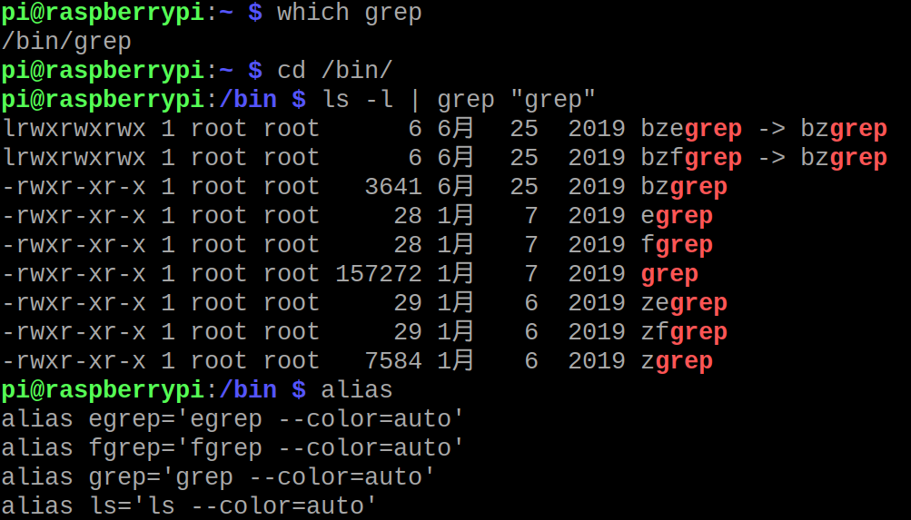

# shell的外部命令grep（搜索关键词）

grep就是用来查找文件流（管道）里面的关键词的！

grep有3个分子：

* grep = grep的原始程序。
* egrep = grep -E = extension grep
* fgrep = grep -F = fast grep



可以看出egrep 和fgrep都非常小。用`cat`查看会发现egrep和fgrep就是grep套了一个外壳。（默认的参数不一样而已）。


### 用法

`grep name people.txt`
这是grep的语法。 在people.txt 文件内，把匹配到name关键词的行。全部都输出到屏幕。

`who | grep "pi"`
也可以用管道的功能。who是返回当前系统有几个用户在登陆使用。 然后结果以流的形式传输到了 grep命令内部。 利用 grep 去查找 ，pi用户登陆的信息。


### 参数

grep的参数不算多，总结如下：
-n 表示输出行号; -v 表示去反显示; -i 表示不管大小写 ; 
grep abc * 表示在当前目录下查找包含abc的行。
grep abc -l *  同上，只是返回之显示哪个文件，不显示行号
grep -c aa people  表示统计匹配到几行。返回一个纯粹的数字

```
grep -n ^dto config.txt #表示以dto开头的行。并且-n为输出行号
grep -v dto config.txt # -v 表示 结果除了dto之外的行全部输出
grep -i aa people # -i 表示不管大小写，进行匹配

echo hhhhh
grep -i aa *	#显示匹配的文件名和对应的一行内容
echo ----
grep -i aa -l *  # -l 表示 之显示查找到的文件名，不显示匹配后的内容


grep -c -i aa people # -c表示匹配到几行
```

此外，grep还支持 posix 字符集。可以这么玩：
`grep [[:digit:]] config.txt`


linux 3剑客：grep，sed，awk。不要太害怕，仔细分析也不太难！