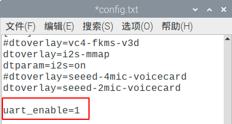
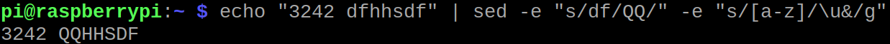

# shell中的 sed （stream editor）

sed是用来匹配某行，然后修改某行的一个工具。因为linux所有的一切东西全部都是文件化的。所以sed用在脚本中，也是家常便饭。去翻翻国外的shell脚本，或多或少会被sed卡死，被那些恶心的语法噎死，例如：

`echo "124324  hahahaha"   |  sed -e  "s/ha/www/" -e "s/[a-z]/\u&/g" `

完全不知道是什么鬼，对不对？


### sed 语法
我们来回忆上grep的语法：`grep 关键词 文件名`。

那么sed的写法也差不多，只是**关键词**这段写的比较恶心。

```
#好人用坏人替换一次！！
echo “我是好人，好人！大好人！！” | sed 's/好人/坏人/'

#好人用坏人替换无限次。
echo “我是好人，好人！大好人！！” | sed 's/好人/坏人/g'
```

这里的s就是substitution（替换）的简写。

* s/		替换
* 好人/	查找的内容
* 坏人/	替换的内容
* g		全局替换，如果是具体的数字，就表示替换几次。i表示不管大小写。

```
echo "我喜欢Linux LINUX LINux" | sed 's/linux/centos/gi'   #3个linux全部替换为centos

#开头的 小a 替换为 大a
echo "albolo is good" | sed "s/^./A/"


# ^.. 表示匹配到任意2个字符。  //中间没有任何字符。表示匹配到后，删除掉。
echo "albolo is good" | sed "s/^..//"

#表示在5-7行前面添加一个#
sed '5,7s/^/#/' lines.txt
```


### sed 支持的参数
* -r 表示支持正则表达式 
* -i 表示备份源和目标文件 
* -n 表示默认不显示匹配（静默模式）
* -f 是运行sed的脚本 `sed -f sed1.sh  people  `

### sed 支持的操作

* s			表示替换      s/aaa/bbb/ig		把aaa用bbb进行替换。大小写不敏感，全局替换, -r 表示支持扩展的正则表达式 -i 表示备份源和目标文件
* p			表示打印		-n "1p" "1,5p"	打印第几行	"/abs/p" 匹配abs后，打印对应的行
* d			表示删除		几乎和p类似。但是他是匹配到就删除对应的行。
* w			表示写入		匹配到某行，然后写入到某个文件
* i\			匹配到某行之后，在某行的前面插入一行。注意是插入到匹配行之前的那行！


p = print 举例：

```
# -n 表示默认不显示，只有匹配到了才显示对应的内容， p表示打印
sed -n '1,2p' lines.txt

sed -n "1p" lines.txt

sed -n '/^dto/p' config.txt

sed -n "/dto/p" config.txt
```

d = delete 举例：

```
sed '1,2d' lines.txt	

sed "/dto/d" config.txt

sed "/aa/d" people
```

w = write 举例： 把匹配到的内容输出到某个文件。算是**另起炉灶**。

```
sed -n "/aa/w haha1" <people 

sed -n "/^dto/w nnn" config.txt

```


i\ = insert ，这个比较恶心。 是先去匹配到某一行，然后在这一行上方在新开一行加入需要加入的内容。这个暂时没想到有什么应用。就先放一下。


### 现实生活中的应用

我想把这句话屏蔽掉。这样linux下次期待uart就不会使能了。这时候可以在这行前面加入一个`#`

```
# 希望在uart之前加入 # ，可以用下面的语句。  & 表示之前的匹配项， # 表示要在前面加入的内容。
sed "s/uart/#&/g" config.txt

sed "s/dto/#dto/g" config.txt
```

用&表示匹配到的uart关键词，然后在&前面加上#，就表示在uart关键词前面加入#。这就是sed流编辑器的好处！


**最后解释一下文章开头的那行命令的意思：**
 
```
# -e 表示多个匹配后的命令 串联执行。  \u&  表示 uppercase    \l 表示lowcase     &表示匹配后的内容进行后期操作！ 
echo "124324  hahahaha"   |  sed -e  "s/ha/www/" -e "s/[a-z]/\u&/g" 
```

第一步是关键词替换，第二部是关键词都变成大写！

