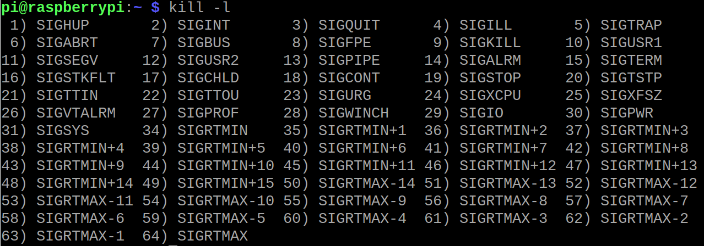

# shell中的trap

trap是shell内的一个内置命令。`which trap`是不会有任何回显的。
**trap的作用是捕捉shell内的信号，然后做对应的动作。这个动作可以是调用函数，也可以是执行简单的命令。**

```
#!/bin/bash

#echo 11

trap "echo 111 " 2


while [ 1 ];do
	echo -n haha
	read i
	echo $i
done
```

这里的2是信号名称，可以用`kill -l`取得。

2号表示ctrl+c（ctrl+d）所产生的信号。

`echo 111`是执行的命令。

整个程序是当用户ctrl+c之后，程序并不终止，而是打印111。

### trap在现实生活中的应用场景
因为脚本是一行一行解析，并且向下执行。用户什么时候按下ctrl+c变成了未知数。trap这个内部命令就可以时时刻刻的去捕捉shell的信号。然后再去执行程序员希望的程序。

比如有一个程序是操作GPIO口的。而程序不知道什么时候会出现异常（用户或者系统产生的信号），当捕捉到异常信号的时候，去执行GPIO的clean up函数。这样可以让程序退出的时候GPIO资源被妥善释放。
