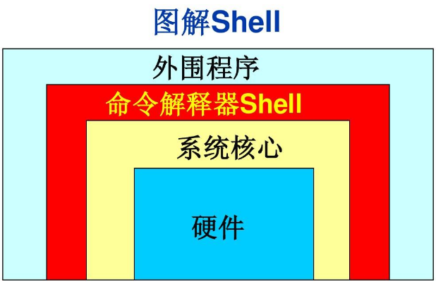

# Shell脚本编程（基于树莓派Pi4上的实战编程）

作者、编辑：rcdrones

### 为什么学习Shell Scripting？
如何渣干树莓派，我想主要分3部分：

* 当游戏机、当机顶盒 
* 学习一些编程知识 
* 把树莓派用于你的商业项目内 

如果你想愉快的玩耍树莓派，避不开学习一点Linux知识。根据笔者的经历，Linux初期入门的时候，你会碰到很多系统提供的命令集（例如：ls、cp、mv、ifconfig等）。然后你会不停的借助搜索引擎补充你的知识体系。然而，当你已有了绝大多数linux操作经验之后，你又会在Shell脚本上栽跟头。比如下面最简单的脚本示例：

```
#! /bin/bash

echo -n "请输入一个数字:"
read num
echo "你输入的是: $num"
```

上面的例子，根据字面意思，你很容易知道这个程序在干什么？但是如果给你一张白纸，让你重新写一个shell脚本。你肯定会卡住，原因就是你根本没有系统性的学习过Shell编程。通过这个系列的教程，我希望你能系统的学习Linux的Shell脚本编程的知识，让你在Linux晋级路上铺平道路。 

### why是晋阶？
因为Shell编程本身就是基于Linux的内部或者外部命令。如果你连`ls`都不知道是干什么的，可以在B站找找往期我制作的视频。或者将来你有幸看到我另外一个系列关于《Linux命令大全的知识》，以帮助你对linux的初步认知。

### why我做这个教程？
因为国内大部分树莓派用户都停留在仅仅对Linux进行打打命令的初步认知阶段。希望系统性的提高，会遇到瓶颈。所以笔者开一个头，制作这一系列教程。再次也是把我脑袋里的Shell脚本编程进行*系统性*的梳理，作为记录笔者的技术沉淀。


**让我们开始这趟旅程吧……**

## Shell解释器的历史



Linux下面有很多种类的Shell：

* sh:最早期的shell，算是鼻祖。全称Bourne Shell
* bash:全称Bourne Again Shell，就是sh的加强版。《大航海时代4代，威力加强版》
* dash:bash的精简版，为了让解析，为了高效率的跑脚本。

```
pi@raspberrypi:/bin $ ls -l -h *sh
-rwxr-xr-x 1 root root 904K 4月  18  2019 bash
-rwxr-xr-x 1 root root  90K 1月  18  2019 dash
lrwxrwxrwx 1 root root    4 4月  18  2019 rbash -> bash
lrwxrwxrwx 1 root root    4 7月  10  2019 sh -> dash

```

* csh、ksh: csh是有c语言语法特性的shell，ksh和巴拉巴拉等也是一些语法衍生品。大家就不用记了。

**这个系列教程我们选大而全的bash作为命令解释器**


## 树莓派的bash在哪里？

用`which`

```
pi@raspberrypi:~ $ which bash
/bin/bash
```

用什么版本？一般就是 -v 或者--version，在不济就是`man bash`

```
pi@raspberrypi:~ $ bash --version
GNU bash，版本 5.0.3(1)-release (arm-unknown-linux-gnueabihf)
Copyright (C) 2019 Free Software Foundation, Inc.
许可证 GPLv3+: GNU GPL 许可证第三版或者更新版本 <http://gnu.org/licenses/gpl.html>

本软件是自由软件，您可以自由地更改和重新发布。
在法律许可的情况下特此明示，本软件不提供任何担保。

```

**学习本教程。不用太担心版本和我不一样，bash近几年基本语法没什么更新了，如果你用5年前的bash，一样适用于这个教程。**