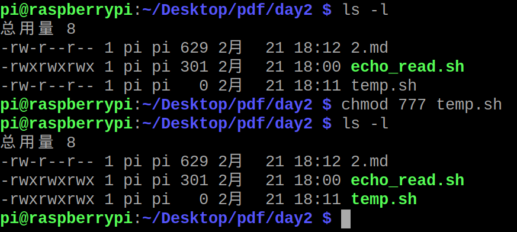
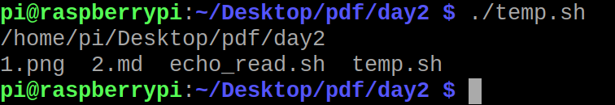

# 2.echo和read用法

### echo就是c语言的printf
具体语法是： 

```
echo "你好"
echo 'nihao'
echo nihao

echo -n "作者"
echo "爱你们哟！！"

```

* ""		内部的变量是先计算或者替换，在打印出来
* ''		内部不进行任何计算
* -n		echo默认输出到回车，-n表示**不要换行**

### read从键盘读取数字or字符串

```
echo "你叫什么名字？？"
read __name__

echo 你好，$__name__

```


### 如何写一个标准的Shell程序?

```
#!/bin/bash

# Author : RCdrones
# Copyright (c) github.com/rcdrones
# Script follows here :


pwd

ls -l

```

然后保存到*temp.sh*。并且增加权限


运行方式：

