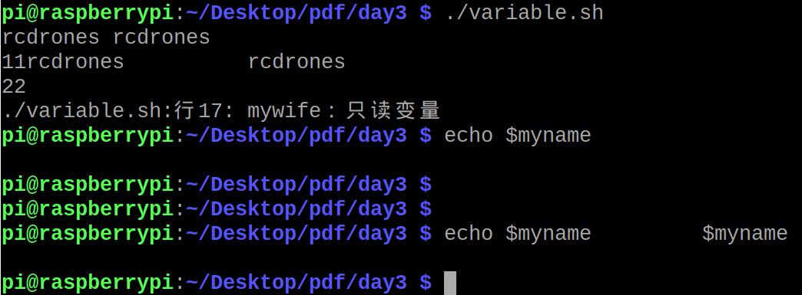

### Shell的变量赋值

shell支持2种变量：整数型和字符串型，都不需要提前定义他们的类型。

```
#!/bin/bash

myname="rcdrones"

# 空格就算1个。
echo $myname         $myname

# 强制多个空格输出
echo "11$myname          $myname"
```

**错误案例：**

```
myname = "66"  # 这条语句是错误的！赋值语句等号两边不能有任何空格！！！
```

### readonly变量
只读变量无法被更改，或者取消！

```
mywife="baby"
readonly mywife
mywife="baby two"  #这里会报错
unset mywife #同样报错
```

### 变量的生存周期
**一般变量只在脚本内生存，离开脚本就挂了**



**变量可以在脚本内被干掉**，利用`unset`语句

```
big_var="8848"
echo $big_var
unset big_var
echo "big_var还存在吗？？打印big_var = $big_var"
```


